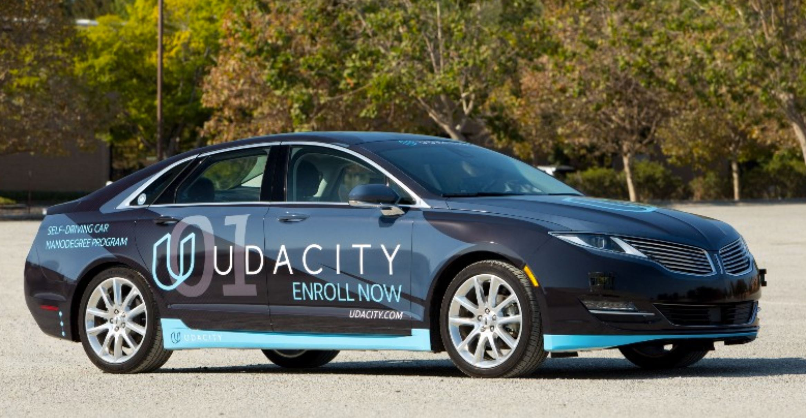
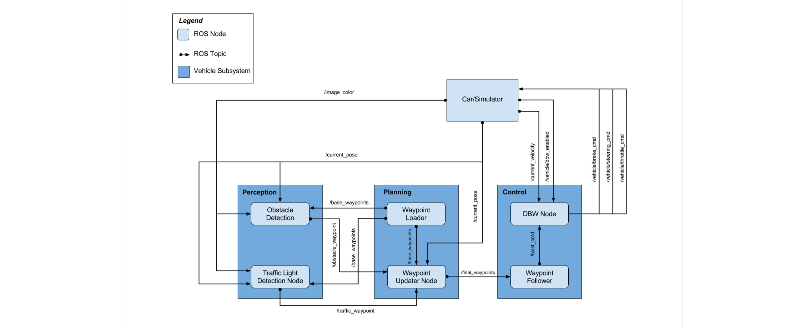
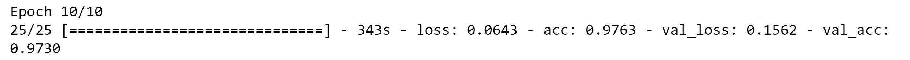
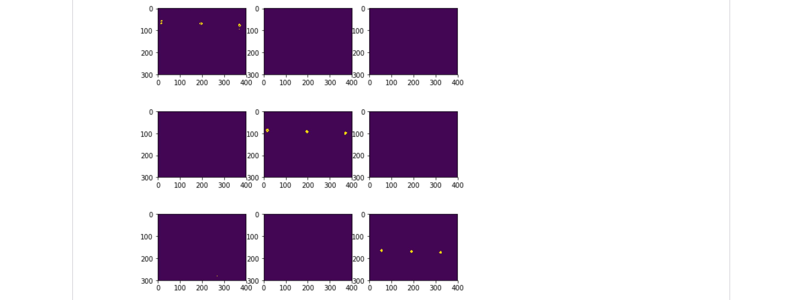

# Programming a Real Self-Driving Car

## System Integration Project
  
This is the project repo for the final project of the Udacity Self-Driving Car Nanodegree. The goal of the project is to fully implement with ROS the main modules of an autonomous vehicle: Perception, Planning and Control.



The project was designed using a simulator where the car drives around a highway test track with traffic lights. The simulator can be found [here](https://github.com/udacity/CarND-Capstone/releases) and starter code [here](https://github.com/udacity/CarND-Capstone) 

For our submission, the logic was implemented and works well in the simulator. For the real world data, we will keep working after the deadline.

## The Team

|           | Name                     |    E-Mail                        |      GitHub                                     |
| --------- | -------------------------| -------------------------------- | :----------------------------------------------:|
| Team Lead | Mark Draghicescu         |    markd38@hotmail.com           |      https://github.com/mark-draghicescu        |
|           | Oana Gaskey              |    oana.gaskey@gmail.com         |      https://github.com/OanaGaskey              |
|           | Ayomide Yusuf            |    mailayomide@gmail.com         |      https://github.com/ayomide-adekunle        |
|           | Rajat Roy                |    rctbraj@gmail.com             |      https://github.com/Rajat-Roy               |


## Overview


The submitted code is implemented in ROS. For this project we mainly use __rospy__, which is a pure Python client library for ROS and enables Python programmers to interface with ROS Topics, Services and Parameters.

## Code Architecture
1. Perception Module
     * 1.1 Traffic Light Detection
     * 1.2 Traffic Light Classifier
     
2. Planning Module
      * 2.1 Waypoint Loader
      * 2.2 Waypoint Updater
      
3. Control Module
      * 3.1 DBW Node
      * 3.2 Waypoint Follower


### 1. Perception Module

#### 1.1 Traffic Light Detection
The Traffic Light Detection node is implemented in [./ros/src/tl_detector/tl_detector.py](./ros/src/tl_detector/tl_detector.py). The node subscribes to `/base_waypoints`, `/current_pose`, `/vehicle/traffic_lights` and `/image_color`. It's role is to find the upcoming red traffic light and to publish its ID to `/traffic_waypoint` topic. This is further used by the `waypoint_updater` node to plan for the vehicle to stop at the line associated with the red traffic light's position.

The `tl_detector` node gets the car's position and the traffic lights list to identify the closesest upcoming traffic light. The upcoming traffic light is taken into account only if it is within 200 waypoints. If a traffic light is within the specified distance, it's state is identified using the Traffic Light Classifier based on camera images.

When a red light is consistently identified for `STATE_COUNT_THRESHOLD` consecutive cycles, the traffic light's waypoint id is published on `/traffic_waypoint` topic. If another state then red is identified, the `-1` value is published to the `/traffic_waypoint` topic which will be used to keep the vehicle going through the intersection. 

#### 1.1 Traffic Light Classifier

The Traffic Light Classifier is implemented in [./data/traffic_light_classifier_data/traffic_light_classifier_augmented.ipynb](./data/traffic_light_classifier_data/traffic_light_classifier_augmented.ipynb).

This classifier was built to identify the traffic light using the whole image from the simulator. Images were collected from `/image_color` topic and labeled with the value `state` from `/vehicle/traffic_lights`topic

```
        # Convert your ROS Image message to OpenCV2
        cv2_img = self.bridge.imgmsg_to_cv2(self.camera_image, "bgr8")
        # Save your OpenCV2 image as a jpeg 
        time = msg.header.seq
        path = '/home/workspace/CarND-Capstone/ros/src/tl_detector/rec_images'
        cv2.imwrite(os.path.join(path , ''+str(time)+'.jpeg'), cv2_img)
        
        light_wp, state = self.process_traffic_lights()
       
        file = open("labels.txt","a")
        file.write('picture = ' + str(time) + ' ' + 'label = ' + str(state) + '\n') 
        file.close()
 
 ```
With over 4000 labeled images that can be found in [./data/traffic_light_classifier_data/rec_images](./data/traffic_light_classifier_data/rec_images) a CNN network was trained.

The model uses a 5 layer 2D convolution structure followed by a flatten and a 4 dense layer chain:
```
model = Sequential()
#normalize data
model.add(Lambda(lambda x: (x / 255.0) - 0.5, input_shape=(300,400,3)))

model.add(Conv2D(24,(5,5), strides=(2,2), activation='relu'))
model.add(Conv2D(36,(5,5), strides=(2,2), activation='relu'))
model.add(Conv2D(48,(5,5), strides=(2,2), activation='relu'))
model.add(Conv2D(64,(3,3), activation='relu'))
model.add(Conv2D(64,(3,3), activation='relu'))
model.add(Flatten())
model.add(Dense(100, activation='relu'))
model.add(Dense(50, activation='relu'))
model.add(Dense(10, activation='relu'))
model.add(Dense(5, activation='softmax'))

model.compile(loss='categorical_crossentropy',optimizer='adam', metrics=['accuracy'])
model.fit_generator(generator = data_generator(train_data),
                    validation_data = data_generator(val_data),
                    epochs = 10,
                    steps_per_epoch  = math.ceil(len(train_data) / 128),
                    validation_steps = math.ceil(len(val_data)   / 128)    )
model.save('model.h5')
model_json = model.to_json()
with open("model.json", "w") as json_file:
    json_file.write(model_json)
print('Model saved')
```
The model was trined in 10 epochs and had a 97.30 percent accuracy.



Eventhough the accuracy of the model is high on the recorded and validation images, it did not perform very well in the simulaion. Its detection was unstable and not reliable.

At this point we decided to give up on the trained classifier and use Computer Vision techniques to identify the traffic light color.

Hue ranges for red, yellow and green were picked based on the images in the simulator. Masks are created to isolate the light using the logic below.
```
    # lower mask (0-10)
    lower_red = np.array([0,50,50])
    upper_red = np.array([10,255,255])
    
    lower_yellow = np.array([20,150,150])
    upper_yellow = np.array([30,255,255])

    lower_green = np.array([50,100,100])
    upper_green = np.array([70,255,255])
    
    
    mask = np.array([cv2.inRange(img_hsv, lower_red, upper_red),
                     cv2.inRange(img_hsv, lower_yellow, upper_yellow),
                     cv2.inRange(img_hsv, lower_green, upper_green)])
    
    
    mask_sum = np.sum(np.sum(mask, axis=1), axis=1)
    label = np.argmax(mask_sum)
```

Given these masks, only the pixels of the lighted areas are selected. The sum is computed on the mask to count how many pixels of a given color were selected.
The position which has the highest number represents the color of the traffic light.

In the HSV images below, red, yellow and green traffic light pictures can be seen with the effect of the masks.




With this approach, the simulation runs smoothly and the car correclty identifies the traffic lights.

### 2. Planning Module

#### 2.1 Waypoint Loader

The Waypointer Loader node is implemented in [./ros/src/waypoint_loader/waypoint_loader.py](./ros/src/waypoint_loader/waypoint_loader.py). There the node gets initizialized and publishes to the `/base_waypoints` topic messages in the `Lane` format defined in [./ros/src/styx_msgs/msg/Lane.msg](./ros/src/styx_msgs/msg/Lane.msg).
  
The `waypoint_loader` node loads the programmed waypoints for the car to follow around the track and the default cruising speed (via the ROS parameter `~velocity`). The function `new_waypoint_loader()` is called which loads and publishes the waypoints with the default cruise velocity attached to them. 
  
The published `/base_waypoints` topic will be used by the `waypoint_updater` node, which will search and filter the relevant waypoints to follow ahead of the vehicle and update target velocities for the car to follow.

#### 2.2 Waypoint Updater

This [node](./ros/src/waypoint_updater/waypoint_updater.py) will publish waypoints from the car's current position to some `x` distance ahead. It will also consider traffic lights and set target speeds.

The `waypoint_updater` node subscribes to `/current_pose`, `/base_waypoints`and `/traffic_waypoint` topics. The node publishes to `/final_waypoints` topic for the Control Module. `LOOKAHEAD_WPS` determines the number of waypoints ahead of the vehicle to be published for the Control Module. `MAX_DECEL` is used to calculate a smooth slowing down curve for the car when it reaches a red stoplight.

`waypoint_updater`'s main role is to compute the behavior of the car for the next `LOOKAHEAD_WPS` waypoints. If there is nothing ahead, than the car shall drive at the already set constant velocity. If there is an obstacle coming up, like a red stoplight, the next waypoints are updated with smooth slowing down velocities to reach a stop at the line in front of the traffic light. 


### 3. Control Module

#### 3.1 DBW Node

The DBW Node is implemented in [./ros/src/twist_controller/dbw_node.py](./ros/src/twist_controller/dbw_node.py) and here is where the steering, throttle and braking signal commands get published to the car or simulator.

The twist controller is implemented [here](./ros/src/twist_controller/twist_controller.py). The twist controller (including the imported [yaw controller](./ros/src/twist_controller/yaw_controller.py)) manages to set the desired linear and angular velocity with the help of a [PID controller](./ros/src/twist_controller/pid.py) and a [Low Pass Filter](./ros/src/twist_controller/lowpass.py) which outputs the necessary actuator signals. We subscribe to the desired linear and angular velocity via the `twist_cmd` topic which is published by the `Waypoint Follower` Node.

#### 3.2 Waypoint Follower

For the `Waypoint Follower` Node we make use of a package containing code from [Autoware](https://github.com/CPFL/Autoware) which subscribes to `/final_waypoints` and publishes target vehicle linear and angular velocities in the form of twist commands to the `/twist_cmd` topic. You can find the code [here](./ros/src/waypoint_follower/src/pure_pursuit.cpp). 


## Native Installation

* Be sure that your workstation is running Ubuntu 16.04 Xenial Xerus or Ubuntu 14.04 Trusty Tahir. [Ubuntu downloads can be found here](https://www.ubuntu.com/download/desktop).
* If using a Virtual Machine to install Ubuntu, use the following configuration as minimum:
  * 2 CPU
  * 2 GB system memory
  * 25 GB of free hard drive space

  The Udacity provided virtual machine has ROS and Dataspeed DBW already installed, so you can skip the next two steps if you are using this.

* Follow these instructions to install ROS
  * [ROS Kinetic](http://wiki.ros.org/kinetic/Installation/Ubuntu) if you have Ubuntu 16.04.
  * [ROS Indigo](http://wiki.ros.org/indigo/Installation/Ubuntu) if you have Ubuntu 14.04.
* [Dataspeed DBW](https://bitbucket.org/DataspeedInc/dbw_mkz_ros)
  * Use this option to install the SDK on a workstation that already has ROS installed: [One Line SDK Install (binary)](https://bitbucket.org/DataspeedInc/dbw_mkz_ros/src/81e63fcc335d7b64139d7482017d6a97b405e250/ROS_SETUP.md?fileviewer=file-view-default)
* Download the [Udacity Simulator](https://github.com/udacity/CarND-Capstone/releases).

### Docker Installation
[Install Docker](https://docs.docker.com/engine/installation/)

Build the docker container
```bash
docker build . -t capstone
```

Run the docker file
```bash
docker run -p 4567:4567 -v $PWD:/capstone -v /tmp/log:/root/.ros/ --rm -it capstone
```

### Port Forwarding
To set up port forwarding, please refer to the [instructions from term 2](https://classroom.udacity.com/nanodegrees/nd013/parts/40f38239-66b6-46ec-ae68-03afd8a601c8/modules/0949fca6-b379-42af-a919-ee50aa304e6a/lessons/f758c44c-5e40-4e01-93b5-1a82aa4e044f/concepts/16cf4a78-4fc7-49e1-8621-3450ca938b77)

### Usage

1. Clone the project repository
```bash
git clone https://github.com/udacity/CarND-Capstone.git
```

2. Install python dependencies
```bash
cd CarND-Capstone
pip install -r requirements.txt
```
3. Make and run styx
```bash
cd ros
catkin_make
source devel/setup.sh
roslaunch launch/styx.launch
```
4. Run the simulator

### Real world testing
1. Download [training bag](https://s3-us-west-1.amazonaws.com/udacity-selfdrivingcar/traffic_light_bag_file.zip) that was recorded on the Udacity self-driving car.
2. Unzip the file
```bash
unzip traffic_light_bag_file.zip
```
3. Play the bag file
```bash
rosbag play -l traffic_light_bag_file/traffic_light_training.bag
```
4. Launch your project in site mode
```bash
cd CarND-Capstone/ros
roslaunch launch/site.launch
```
5. Confirm that traffic light detection works on real life images
